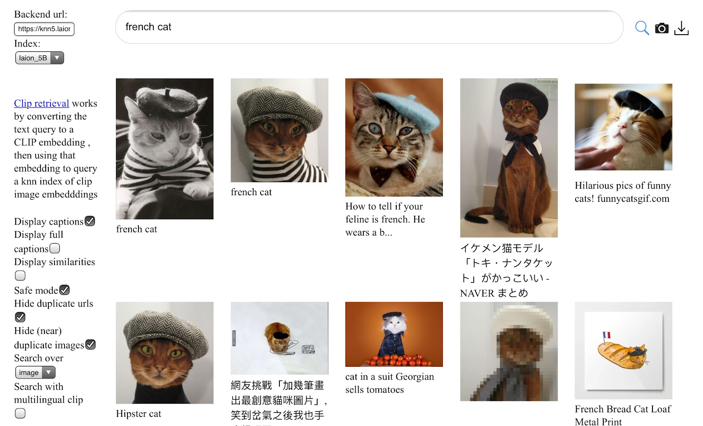
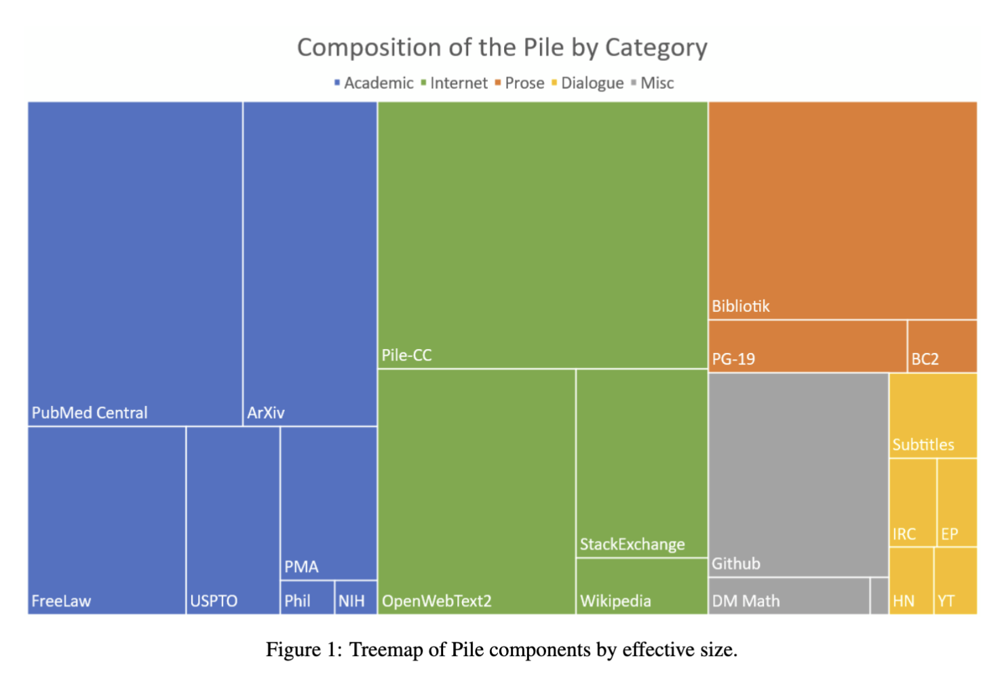

April 28, 2023

If you’ve seen the recent TikTok trend of transforming people into historical versions of themselves^[[Lensa AI climbs the App Store charts as its ‘magic avatars’ go viral](https://techcrunch.com/2022/12/01/lensa-ai-climbs-the-app-store-charts-as-its-magic-avatars-go-viral/)], or had a conversation with the chatbot ChatGPT you’ve interacted with generative AI. 
<!--In the last year, use of generative AI has exploded. People now use it to generate songs, pose as customer service representatives, and aid in drug discovery. -->
These impressive capabilities are driven by a comparable explosion of available data on the web–driven, in part, by all of us.
<!--Very large datasets have played a significant role in AI progress in general over the years, but have been absolutely critical to generative AI development. -->
Any media that you have posted publicly — words, images, videos, etc. — are fair game for being used as training data for these generative models.^[In this case, public does not mean places like Facebook’s friends list, but does mean Twitter and Reddit.]
This might not feel so different from how companies and websites already collect and train on your data, but the way generative models are trained means your data can be memorized and re-generated by generative models in new contexts. 
That’s because generative AI models are trained to exactly reproduce their training data. If the sentence “Mary had a little lamb” were in the training data, then the model would get rewarded more for choosing “lamb” after it sees “Mary had a little” than any other word (even though Mary probably also had other farm animals!). 
^[Generative models today are often general purpose, but you could imagine training a model specifically on human-written code (such as CoPilot), legal data, news, Tweets, speech, old-school films, and so much more. For the incredibly broad definition of data, there is an equally broad set of possible generative models that could be trained. ]

Welcome to an explainer series where we lay out the building blocks for generative AI models and shed some light onto the copyright issues that might arise. 

_Why copyright?_

Some of the data in training datasets may be copyrighted or have licenses attached. There is an active debate over whether training on copyrighted data constitutes infringement, and if an output that looks almost identical to the training data constitutes infringement. This debate centers [several](https://www.theregister.com/2023/01/16/stability_diffusion_lawsuit/) [recently-filed](https://www.smithsonianmag.com/smart-news/are-ai-image-generators-stealing-from-artists-180981488/) [lawsuits](https://githubcopilotlitigation.com/) related to [copyright](https://stablediffusionlitigation.com/) in generative AI models.

Generative AI models change the landscape of what content creation could look like and questions individual ownership over and our relationship to our data. Copyright is just one lens for individuals and corporations to maintain control over their content and monetize it. Privacy issues also arise when discussing data collection for generative models. Additionally, questions of labor and compensation may also arise alongside copyright issues. 

In this first chapter, we’ll build an understanding of how dataset creators juggle choices for what to include in a dataset, and the implications that their choices have for the generative AI model. In later chapters, we’ll discuss copyrightable works in the training data, the model generation process, whether training or outputs are infringement, and liability that model creators / distributors might have. 

> Jump to a specific chapter
> 
> 1. [**How is training data constructed?**](#intro)
> 2. **What is copyrightable?** [coming soon]
> 3. **How do you generate from generative AI models?** [coming soon]
> 4. **Is training infringement? Do outputs infringe?** [coming soon]

## Chapter 1: Training data {#intro}

by [Katherine Lee](https://katelee168.github.io/) and [Daphne Ippolito](https://daphnei.com/)  
April 28, 2023

The direct impact training data has on the outputs of generative models, aka *generations*, makes training data design the most important set of choices model creators have to reduce the risk of copyright and privacy infringements of the resulting, generative model. 
^[I have to couch this by saying that training dataset design is the _current_ most important set of choices model creators have. There are other models in the works that are trying to reduce copyright and privacy infringements by attributing generations to specific examples in the data, or by adding noise to obscure individual data points (differential privacy), or by limiting the scope of a model to an application where copyright and privacy are less of a concern (for example, Disney training on scripts where they own all the copyrights).]
To put it bluntly, if there are no Garfield comics in your training data, what are the odds of spontaneously generating a Garfield comic?
The sheer amount of data required for modern-day model training makes it impossible for dataset curators to interact with each item in the dataset and thus impossible to know exactly the content, source, and context of each item in the dataset. 
While a dataset curator might be able to answer the question: “How many Garfield comics are there in the training data,” they might not be able to answer the questions: “How many fan or parody Garfield comics are there in the training data.” 

In this chapter, we discuss datasets of the not-so-distant past (the late 1990s and early 2000s) and how datasets and dataset collection practices have changed. Then, we discuss what the choices data curators make to create modern-day, generative-AI datasets. 
Finally, we acknowledge both the difficulty in making educated choices and the real impact those choices have on the resulting models. 

### Chapter 1: TOC

1. [**Early Datasets**](#early-datasets): Early datasets (pre-2010) were much smaller, had denser annotations, and required manual curation. 
2. [**Today’s Datasets**](#today-datasets): Today’s datasets are on the scale of multiple terabytes. It’s impossible to annotate or fully understand these datasets. 
3. [**Data collection**](#data-collection): Datasets collection requires making a lot of choices about what data is relevant. The impact of those choices on generations from the model is not well understood. 
4. [**Data curation**](#data-curation): Data curation requires understanding the goals of the models, which are often un-, or under-specified, and the cultural context of the data. Again, the size of the datasets can make this a challenges.
5. [**Conclusion & Next: Copyright and Training Data**](#next)

## Early Datasets {#early-datasets}

> Early datasets (pre-2010) were much smaller, had denser annotations, and required manual curation. 

We’ll start our story with one of the first dataset machine learning students learn about: MNIST.
^[[About MNIST](https://www.lri.fr/~marc/Master2/MNIST_doc.pdf). The original website seems to be password-protected: https://yann.lecun.com/exdb/mnist/.]
First released in 1999, the dataset was built by Mixing two datasets from the National Institute of Science and Technology's datasets of handwritten numbers. It contains only 60,000 examples. 
(As a point of reference, LAION-5B, an image dataset made in 2022, has 5.85 billion text-image pairs.)
The dataset creators knew where all the data was from and how it was collected: all the digits in MNIST were written by either high school students or employees at the US Census Bureau.
The data in MNIST is highly uniform: all the images are 32x32 pixels, presented in black-and-white, and the digits are roughly centered within the images.

<figure style="text-align:center;">
  
  
  <figcaption>**left**: Examples from [MNIST](https://en.wikipedia.org/wiki/MNIST_database). **right**: Examples from [LAION 5B](https://laion.ai/blog/laion-5b/).    Note the uniformity of the images in MNIST vs. the varying aspect ratio and image quality in LAION. Additionally, LAION images come with much longer captions that don’t always exactly describe what is in the image, whereas labels associated with MNIST images are the number written in the image.</figcaption>
</figure>

Unlike both MNIST and LAION, early-language datasets were densely annotated and focused on using linguistic structure to parse text. 
^[We might use linguistic structure to understand that "the dog" is a noun phrase serving as the subject of the sentence in the sentence: "a dog bit my leg". Additionally, we might infer from context that a dog is the sort of thing that is more likely to bite than a leg, and that a leg is the sort of thing that a dog might bite.]
That’s because early work in natural language processing  assumed that building a language system would simply involve encoding this type of linguistic knowledge and mechanically applying it. 
This trend was led particularly by NIST in Information Retrieval through the [Text REtrieval Conference (TREC)](https://trec.nist.gov/)^[[Delgado, et al. 2022](https://dl.acm.org/doi/10.1145/3512898) also provide an interesting history on participatory design at TREC.] and related conferences and by the [Linguistic Data Consortium (LDC)](https://www.ldc.upenn.edu/) who curated collections like [Penn TreeBank]((https://catalog.ldc.upenn.edu/LDC99T42)) which contained a collection of thousands of stories from the Wall Street Journal annotated for linguistic properties like parts-of-speech, and disfluency.
These collections emphasized linguistic *annotations* such as parse trees or relevance judgments, and the datasets took a lot of effort to curate. For example, [WordNet](https://wordnet.princeton.edu/), another dataset, was entirely manually created and curated over the course of the decade from 1985 to 1995.

And yet, these datasets are tiny compared with present-day language datasets. The current version of WordNet (v3.0, released in 2006)^[[Princeton University "About WordNet." WordNet. Princeton University. 2010.](https://wordnet.princeton.edu/)] is 10.5MB compressed, Penn Treebank, another dataset from that era (1995) is 2MB compressed, and [the Pile](https://arxiv.org/abs/2101.00027), released in 2020, is 800GB.

The first shift towards larger datasets was driven by the growth of the internet, a decrease in computer storage costs and computational cost (compute), and a growing interest from governmental organizations like NIST and DARPA and commercial organizations like and TODO. 
First, text data in digital form became much more available due to the rise of the internet. Datasets such as [20 Newsgroups](http://qwone.com/~jason/20Newsgroups/) took advantage of news posted online [TODO]. 
Second, the internet also enabled expensive, annotated datasets to be easily shared.
Third, the growth of online activity provided compelling operational use cases for data-driven statistical models. Internet search supercharged information retrieval research, and spam classification proved a watershed in the impact of ML-based classifiers. These statistical models became more powerful as compute costs decreased and enabled larger models to process the now larger datasets.

However, these larger collections remained special-purpose. Collections were built to support specific applications; the focus remained on annotations as the key value, and collection sizes tended to be in the thousands and tens of thousands of documents. While "unlabeled" text began to be more readily available, it was difficult to show that it had any real value beyond smaller, supervised datasets. As a result, data work tended to focus on layering annotations on existing documents, most notably the Penn TreeBank articles.
Language datasets of that time were reflective of both the technical limitations of the computers and systems that researchers ran, and model design.
At the time, natural language models were similarly hand-designed, and relied on features like TODO that TODO. For instance, IBM’s Watson (developed in 2011) explicitly parsed sentences into linguistic components then used hand-designed features to win at Jeopardy. 
Up until 2016, Google Translate similarly used phrase-based translation which broke sentences into linguistic parts to translate separately^[[A Neural Network for Machine Translation, at Production Scale](https://ai.googleblog.com/2016/09/a-neural-network-for-machine.html)].

## Today’s datasets {#today-datasets}

> Today’s datasets are on the scale of multiple terabytes. It’s impossible to annotate or fully understand these datasets. 

Since MNIST has been so extensively studied,^[Over 6000 papers cite MNIST directly and a Google Scholar search returned 76,900 articles that mention MNIST.  MNIST has become synonymous with “small, standard dataset” so other datasets like Fashion-MNIST, which has photos of clothing, also appear in the search results.]
 we know how many and which examples are labeled incorrectly.
^[Several papers investigate mislabeled images in MNIST, including: [Northcutt, 2019](https://arxiv.org/abs/1911.00068), and ]
In contrast, modern datasets are entirely different.
Given the massive size of these datasets, it is infeasible for anyone to identify potentially mislabeled or misleadingly labeled images, let alone understand why they might be labeled that way.
Additionally, there are more ways for images to be mislabeled or misleadingly labeled. LAION captions may not describe the content of the image at all, or may not accurately describe the image  the LAION captions may not even accurately describe the content of the image and could even be written in multiple languages. 

The datasets used to train today’s large language models are massive and predominantly contain data scraped from the web^[The Pile, ROOTS, and Chinchilla all combine data scraped from the web with additional data sources.]. The Pile and C4 are both 800GB; [ROOTS]((https://huggingface.co/bigscience/bloom#training-data)) was 1.6TB of pre-processed text, and the unreleased dataset Chinchilla used for training is 5.3 TB^[The number reported in their [paper](https://arxiv.org/abs/2203.15556) was 1.4T tokens, or 4x the training data for a different language model, Gopher, which used 300B tokens. For [Gopher](https://arxiv.org/abs/2112.11446), they sampled 12.8% of the dataset _MassiveText_ that contains 10.5TB of data. 0.128 * 4 * 10.5TB = 5.3TB]. 
It’s impossible for dataset creators to read each individual data point let alone annotate them. 
This automated collection process can obscure important context such as the provenance of the data. 
For data in these large, web-scraped datasets, dataset creators might know that a paragraph of text is from a particular website, but that won’t necessarily tell us who the author of the text is, or who the photographer or artist is and whether they have permission to post the content.
For example, chat logs are typically between two or more people. Both people do not need to consent for one person to put that chat log somewhere publicly where it could become part of the dataset. The chats could also become public through a data leak, or as a result of malicious action, for example, personal chats were leaked during the GamerGate harassment campaign^[GPT2, another language model, generated a conversation between two real individuals using their usernames. This conversation wasn’t exactly as it appeared in the GamerGate harassment campaign, but was about the same topic. More on this topic in [this blog](https://bair.berkeley.edu/blog/2020/12/20/lmmem/) and [this paper](https://dl.acm.org/doi/fullHtml/10.1145/3531146.3534642).]. 
The entire movie *The Fast and the Furious*, could become part of a dataset without the dataset creator’s knowledge because someone decided to tweet out the entire movie in two minute clips^[[Twitter's copyright system seemingly broken as full-length movies are posted on platform](https://mashable.com/article/twitter-copyright-full-movies)].
^[Other copyright concerns could arise. For example, there are instances of individuals taking Github repositories that have a license and reposting it without the original license.]
Dataset creators also might not know that individuals in a given country have adapted to censorship by using a homophone to discuss sensitive topics^[But interestingly, the generative AI model might uncover that pattern.]. 

Scraped Internet data is not the only source of modern datasets.
There still exist small, curated datasets. However, today, these are more often used to evaluate models. One such dataset is [Big-Bench](https://github.com/google/BIG-bench), a compilation of many, mostly hand-curated datasets.
^[The distinction between evaluation and training is not super clear. Evaluation datasets are often benchmarks that come with a training and test set. It’s common practice to train on the data from the training set of the evaluation benchmark then test on the evaluation benchmark’s test set].
There are also large datasets containing proprietary data. Those datasets may be annotated with user actions, such as number of stars for Amazon Reviews, or Netflix recommendations. [Amazon’s Review dataset](https://nijianmo.github.io/amazon/index.html), released dataset in 2018, contains 233.1M examples with customer ratings, and [Netflix’s recommendations dataset](https://www.kaggle.com/datasets/netflix-inc/netflix-prize-data) contains 100M customer ratings. Other popular datasets in this vein are [IMDB movie reviews](https://www.kaggle.com/datasets/lakshmi25npathi/imdb-dataset-of-50k-movie-reviews), or the [Google Books N-gram corpus](https://en.wikipedia.org/wiki/Google_Ngram_Viewer) (2.2 TB of text!).

Today’s language models, just like today’s image models, use many fewer annotations and rely more on computational power to discover statistical patterns.
It wasn’t just the growth of the internet that drove the growth in dataset sizes, increased computational power (a.k.a. compute) and new model designs meant that statistical models increased in capacity and became better at finding patterns in unstructured data. 
These shifts also decreased the need for annotations since models were able to pick out patterns in the data that corresponded with tasks without relying on data that was curated for the task. 

For example, many generative models are trained to generate the next word in the sentence. However, modern models can perform tasks like reversing a sentence^[Try it yourself in [ChatGPT](https://chat.openai.com/).], that they weren’t explicitly trained to do^[Other modern LMs can be trained with other objective functions, like masked language modeling (also called span corruption), or the UL2 loss. More info [here](https://ai.googleblog.com/2022/10/ul2-20b-open-source-unified-language.html)]! Modern models are not successful every time. However, providing examples of what “reversal” means in the prompt to the model can help the model understand the pattern^[Models also pick out patterns that we don’t care for in the data–which is the motivation behind model alignment–to keep only the patterns we want. Also whether models are actually able to pick up patterns that we “care about” is hotly debated amongst researchers.].

**TODO** older datasets still used for evaluation

## Data collection {#data-collection}

> Datasets collection requires making a lot of choices about what data is relevant. The impact of those choices on generations from the model is not well understood. 

The balance of genres in a dataset affects the model's knowledge and ability. 
For example, should the dataset be primarily one language? Should it include an equal balance across as many languages as possible? What about an unequal balance across languages? That question actually hides even more choices. If an English sentence includes a single Italian word, is that sentence English or Italian? What about the sentence, “I walked from campo dei fiori to santa Maria degli angeli?” Additionally, many situations are contextual and cultural. Before René Magritte’s 1929 painting, we would have said “Ceci n'est pas une pipe” was French, but today, it would also be commonly understood by many English speakers.
As much as we would like to back each decision on what data to include by science, it’s cost- and compute- prohibitive to run a different experiment for each decision. 
Thus many of these decisions are just choices the dataset creator makes.

<figure style="text-align:center;">
  
  <figcaption>Est-ce French? Is this l'anglais?</figcaption>
</figure>

Even within one language there are many varieties of text that come from different sources. Data from Twitter, code repositories, personal blogs, advertisements, FanFiction, PasteBin dumps, text for search-engine optimization, and so on, are going to look very different.
Dataset creators make assumptions about the content of each domain and often choose to include or exclude entire domains. 
For example, Wikipedia is a popular source of data because it contains curated articles about a diverse array of topics. If the dataset creator wanted to create a model that was able to give coding advice, they may choose to include StackExchange or Github data as well.
^[Github contains far more than just code. For example, many repositories also contain Readmes written in prose. Additionally, since many websites and blogs are hosted on Github, Github can also contain personal, narrative stories.]
But Wikipedia isn’t conversational. If interactions with the generative model are meant to feel fluid and natural, then the dataset creator may choose to add chat data, such as Youtube Subtitles, HackerNews conversations, or Twitter. 

In one popular language dataset, the Pile, the dataset creators chose to include multiple “academic” datasets, like PubMed, ArXiv, and FreeLaw, and code from Github. This means that models trained on the Pile will have seen medical literature, legal literature, and code. A model not trained on code would have a much harder time generating code^[This doesn't mean that models not explicitly trained on code can’t generate code. Webscraped data is not clean, and there will inevitably be some code mixed in.].

<figure style="text-align:center;">
  
  <figcaption>[The Pile](http://arxiv.org/abs/2101.00027) is made up of many smaller datasets. Many of these components are web-scrapes focused on a specific domain, such as Wikipedia, StackExchange, USPTO (United States Patent and Trademark Office), and ArXiv. Some components, like Enron Emails,  EuroParl^[“Proceedings of the European Parliament in 21
European languages from 1996 until 2012” ([The Pile](http://arxiv.org/abs/2101.00027)).], and Project Gutenberg^[Collection of out-of-copyright books available online.] are not explicitly scraped from the web.</figcaption>
</figure>

There have been some efforts within the ML community to encourage dataset creators to document the choices they made. 
A common choice is to create a [datasheet](https://arxiv.org/abs/1803.09010) which collects information about how the data was collected, the motivation behind it, any preprocessing that was done, and future maintenance plans.^[Many datasets available on HuggingFace (a popular open-source model and dataset repository) now have datasheets attached to them.]
As an example, this is the Pile’s [datasheet](https://arxiv.org/pdf/2201.07311.pdf). 
However, even an extensive datasheet like the Pile’s still still answers only a tiny fraction of the questions you could ask about what data it contains, why it was included, and how it was collected.
Additionally, many companies don’t release many details about their proprietary datasets.
^[For example, we don’t know much about the training data for ChatGPT, nor the difference between ChatGPT’s and [Claude’s](https://www.anthropic.com/earlyaccess) datasets. However, to the extent that similarity between training data and the user’s downstream task has an impact on the generative AI’s performance on the tasks, then companies should feel motivated to document and release additional information about what was in the training data to enable users to choose the right API for their application.]

## Data curation {#data-curation}

> Data curation requires understanding the goals of the models, which are often un-, or under-specified, and the cultural context of the data. Again, the size of the datasets can make this a challenge.

While dataset curators frequently say they want “clean data,” the term is a misnomer. Instead, dataset curators typically mean that they want a dataset that creates a “good model.”
“Good” is extremely un- and under-specified which makes many possible choices of data valid. 
^[Many generative AI models are referred to as “general purpose models.” Models are never general because data and modeling choices create preferences and limitations, however, the intent of the creators is to make the model as general as possible.]
Some model creators will also specify a “good model that doesn’t cause harm.” Let’s get a little more specific with that and take “don’t generate toxic content” as an illustrative example. It’s an easy goal to state but hard to implement. 

What constitutes "toxic" content  is ill-defined and constantly evolving, and classifications of toxicity can be correlated with other aspects of text, such as sexual explicitness.
^[[Prior work](https://maria-antoniak.github.io/resources/2021_acl_bad_seeds.pdf) demonstrates how biases can seep into bias measurements through choices in the topics.]
^[The [Perspective API](https://medium.com/jigsaw/better-discussions-with-imperfect-models-91558235d442) is one API that tries to identify “toxic” content. Again, what is considered “toxic” is context dependent, and in this case may be better explained as “stuff you don’t want advertisements associated with.”]
For example, the Texas’ Liberty County Vindicator posted the full text of the Declaration of Independence and [Facebook’s moderation flagged it as hate speech](https://www.washingtonpost.com/news/the-intersect/wp/2018/07/05/facebook-censored-a-post-for-hate-speech-it-was-the-declaration-of-independence/]).
Additionally, different individuals or groups may have different interpretations of the same text, complicating the process of deciding what data to include and exclude. 
For example, the LGBTQ community centers sexual orientation and sexual experience. Filtering out data related to sexual orientation and sexual experience could inadvertently remove data related to the LGBTQ community.
^[[This paper](https://arxiv.org/abs/2104.08758) provides an example of this in the dataset C4.] ^[One way to approach this challenge is to adopt a more flexible and inclusive approach to data collection and analysis. This may involve working closely with individuals or groups who have expertise in the cultural context under study and being open to multiple perspectives and interpretations. Overall, it is important to recognize that cultural data is often fluid and dynamic, and our understanding of it may change over time. Therefore, any process for determining what data to include and exclude must be adaptable and open to revision as new insights emerge. It may also involve acknowledging the limitations of quantitative methods in capturing the full complexity of cultural data and being open to using qualitative approaches that allow for more nuanced and contextualized analysis.]
Whatever process we use must be adaptable and open to revision. We can never have a black and white process of determining what data to include and exclude because we are dealing with cultural connotations that resist quantification and objectivity.

However, the scale of the datasets encourages dataset creators and curators to use automatic methods to decide on mass what data to include or remove. 
For example, a secondary model trained with labels for “toxic” or “low-quality” data could be used to label all data in a dataset. This present-day annotation is much less structured than prior, linguistic annotations. 
Even with data curation, the training data for the largest generative models are still minimally curated compared with standard dataset collection practices from pre-2017.
^[It’s not a secret that most datasets are crap. And by crap, we mean that they’re incredibly messy. In all data science, the first step is to “clean” and explore the data. Of course, “crap” is a catch-all term, and the ways in which data can be messy varies widely. However, whenever you’re dealing with large collections of data that are not cost-effective to manually curate and inspect, the dataset will necessarily contain anomalies and errors. Even if it were possible to manually curate and inspect the entire dataset, it would be impossible to find all possible patterns across the data because we are 1. All humans who have limited brain capacity and whose background makes it easier to identify some patterns and not others, and 2. Some patterns are not semantically meaningful to humans.]

Unfortunately, even if we agreed on what was “toxic” there isn’t a clear, technical solution for how to reduce toxic content. Some researchers propose removing any data deemed “toxic,” and other researchers disagree arguing that it’s better to include some “toxic” data so that models are able to identify and stop generation of “toxic” content [**TODO**, citations] and argue that we should control outputs of models, not inputs.
Labeling data for concepts like “toxicity” can help evaluate generations from models.
These annotations need not be structured as a dataset, and some creators of generative models prefer to directly annotate the media produced by the model. This labeled data can also be useful for future training purposes, as it can be used to train classifiers based on the new labels.

The lack of technical consensus here is often not for lack of desire but rather a reflection of both how many of these questions are societal and cannot be answered technically, and also of the computational cost required to investigate these questions.
The process of testing whether to include a slice of data can involve training a model with and without that slice of data. That’s called ablation testing. Unfortunately, today’s models are massive (billions of parameters) and can cost millions of dollars to train. Also, unfortunately, testing with smaller models doesn’t always have the same results as testing on larger models making straightforward testing cost-prohibitive.
^[Models develop capabilities at larger sizes ([Wei, 2022](https://openreview.net/forum?id=yzkSU5zdwD))]
This means that model creators can’t afford to test every possible definition of “toxic” or every combination of “include/exclude” for different types of data.

And yet, including or excluding, and identifying “toxic” content is just one of many, many choices dataset curators have to _just make_.
As we discussed before in the section [_Data Collection_](#data-collection), dataset creators must also decide whether to include mostly text in one language or whether to mix in multiple languages. The line between dataset curation and creation isn’t well-defined and people can use either term to refer to the same acts.
^[I’ve arbitrarily used data collection to refer to adding data to the dataset and data curation to be filtering data out of the dataset. Ultimately, adding and removing data are just a series of choices dataset creators and curators can make about what can be included. Dataset curation is a part of the dataset creation process. Additionally, the choice of adding particular sub-datasets means choosing to exclude other sub-datasets, which is also a curation choice. The reason to use two terms, dataset creator and dataset curator, at all is because often datasets are created and then filtered later on by a different set of people. ]
Datasets can also be curated differently depending on the application at hand.
For example, another choice dataset curators may make is whether it’s better to include mostly chat logs when creating a chat bot or if dataset creators should also include news articles or code.
All this is to say that dataset collection and curation is an active area of research for which the answers depend heavily on the open-ended goals of generative modeling.
^[This is not to say that “open-ended” is necessarily bad. One exciting result from generative AI releases has been seeing the multitude of ways people have used the systems. Exciting, and perhaps unintentional.]

## Conclusion & next up: Copyright and Training Data {#next}

What dataset creation really boils down to is a set of choices. Datasets could look different, and they _were_ different. But today’s datasets are shaped by the present set of influences: model sizes, availability of data and compute, open-ended goals (and sometimes, a lack of desire to specify a specific goal), difficulty defining societal concepts, and business incentives.

We started this journey discussing how the choices in training data can raise copyright issues. Next in this series on generative AI, we’ll discuss what sorts of copyrightable works could be included in the training data, why they may have ended up there, and whether or not that is permissible. Additionally, we’ll discuss how different media (text, image, video, music, etc.) might require different treatment.

<!-- Instead, dataset curators typically mean that they want a dataset that creates a “good model.”
Ultimately, datasets exist to serve the tasks we want models to do. "General purpose" is not a task that it is easy to develop a dataset for.
Fro example, OpenAI's models are trained for the goal of being general-purpose, except if the purpose is generating hate speech.
 -->
 
## Dedicated to Chris Cieri

This piece is dedicated to the late, [Chris Cieri](https://www.ldc.upenn.edu/christopher-cieri-1963-2023), director of LDC, with whom we had discussed the early versions of this paper in 2021. 

## Acknowledgements

This discussion is fueled by years of discussions with wonderful people, including, but not limited to: [James Grimmelman](https://james.grimmelmann.net/), [David Mimno](https://mimno.infosci.cornell.edu/), [A. Feder Cooper](https://afedercooper.info/), [Daphne Ippolito](https://daphnei.com/), [Nicholas Carlini](https://nicholas.carlini.com/), [Florian Tramèr](https://floriantramer.com/), [James Bradbury](https://twitter.com/jekbradbury), [Shayne Longpre](https://www.shaynelongpre.com/) and Chris Cieri
