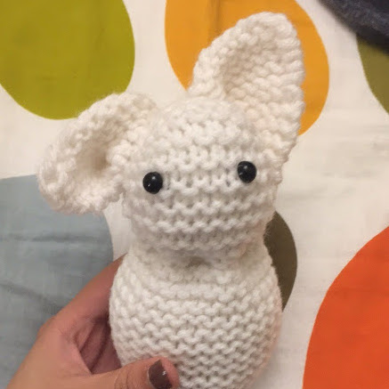

<!-- Sidebar -->
<section id="sidebar">
	

		<nav>
			<ul>
				<li><a href="#intro">About</a></li>
				<li><a href="#one">Research & Projects</a></li>
				<li><a href="#two">Crochet</a></li>
			</ul>
		</nav>
	

</section>

<!-- Wrapper -->

<!-- Intro -->
<section id="intro" class="wrapper style1 fullscreen fade-up">
	

		<h1>Katherine Lee</h1>
		
I'm a human who enjoys studying other humans, <a href="#one">statistics</a>, and education.  
		Sometimes I link the three.  
		 
		 
		I spend a good amount of time dancing, <a href="#two">crocheting</a>, and reading.  
		I love listening to 80's cardio, jazz, and <a href="https://soundcloud.com/yosi-horikawa/bubbles">Yosi Horikawa</a>.

		<!--<ul class="actions">
			<li><a href="#one" class="button scrolly">Projects</a></li>
		</ul>-->
	

</section>

<!-- One -->
<section id="one" class="wrapper style2 spotlights">
	<section>
		
		

			

				<h2>Functional connectivity through fMRI imaging</h2>
				
words about brain connectivity!

				<ul class="actions">
					<li><a href="#" class="button">Learn more</a></li>
				</ul>
			

		

	</section>
	<section>
		
		

			

				<h2>Functional connectivity in C. elegans</h2>
				
words about brain connectivity!

				<ul class="actions">
					<li><a href="celegans.html" class="button">Learn more</a></li>
				</ul>
			

		

	</section>
	<section>
		
		

			

				<h2>Generating quality Reddit comments</h2>
				
about the NBA!

				<ul class="actions">
					<li><a href="#" class="button">Learn more</a></li>
				</ul>
			

		

	</section>
	<section>
		
		

			

				<h2>Optimally seating employees at Google</h2>
				
with mixed integer linear programs!

				<ul class="actions">
					<li><a href="#" class="button">Learn more</a></li>
				</ul>
			

		

	</section>
	<section>
		
		

			

				<h2>Feature selection for hyperspectral imagery</h2>
				
at the naval lab

				<ul class="actions">
					<li><a href="#" class="button">Learn more</a></li>
				</ul>
			

		

	</section>
</section>

<!-- Two -->
<section id="two" class="wrapper style3 fade-up fullscreen">
	

		<h2>Crochet</h2>
		
little amigurumi animals

		

			<section style="padding-left: 48px;">
				<h3>Hazel the Bunny</h3>
				
			</section>
			<section style="padding-left: 48px;">
				<h3>Arthur the Elephant</h3>
				

			</section>
		

		

		

	

</section>

